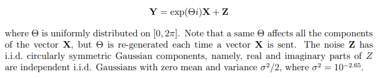

# QAM modulation for complex AWGN communication

Transmission of a message over a complex AGWN channel with the following characteristics :



`numpy` and `jellyfish` are required to run the script, they can be installed with : `pip install numpy jellyfish`.

The program can be ran using the following command :

```sh
python main.py --srv --n=1 --m=64 --k=9 --lim=0.9 --init_file initial.txt
```

In the above command the values used for `--n`, `--m`, `--k`, `--lim` and `--init_file` are the default ones, when `--srv` is set the channel used is the one on the EPFL server (VPN required) otherwise it uses a simulated channel locally, the `--n` argument allows you to run the transmission multiple times and get an average difference, the `--m` argument is there to choose the number of points in the QAM constellation, the `--k` argument defines the number of points that should be used to estimate theta, the `--lim` argument sets the limit of the QAM constellation and the `--init_file` argument passes a txt file to the program to transmit.

For a smaller n, the best parameters are :

```sh
python main.py --srv --m=144 --k=3 --lim=1.15
```

Which gives a n of 81.
